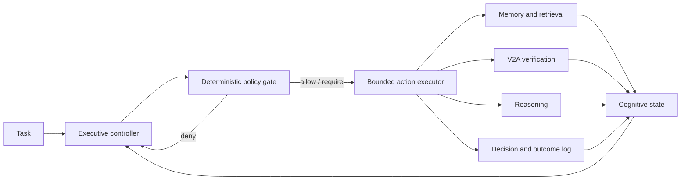
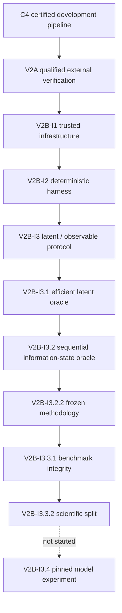

# DAPH v3.7.1

### Auditable adaptive memory, external verification, and metareasoning research

[](pyproject.toml)
[](#verification)
[](LICENSE)
[](#scientific-status)
[](#v2b-i332-scientific-split)

DAPH is a gate-structured research system for testing when an AI should
retrieve, verify, reason further, defer, or stop. It combines a bounded memory
pipeline with immutable evidence, typed verification, deterministic policy,
exact latent and observable oracles, and replayable experiment artifacts.

The repository is deliberately conservative about claims. A mechanism is not
treated as scientifically established because it exists or passes unit tests.
Every research result has an explicit source identity, frozen protocol,
environment boundary, and evidence package.

> **Current state:** V2A external verification is qualified at its frozen
> historical commit. V2B-I3.3.2 is a frozen scientific-benchmark milestone—not
> an executive result and not a production-readiness claim.

## Why DAPH

Most agent systems optimize the answer while leaving the control process
implicit. DAPH makes that control process explicit and measurable:

- Is the available evidence sufficient?
- Is a relevant memory verified, stale, conflicted, or falsified?
- Would retrieval help more than additional reasoning?
- Is verification worth its cost under the remaining budget?
- Should the system answer, defer, or stop?

The active V2B program evaluates those decisions using the fixed action set:

```text
ANSWER · RETRIEVE · VERIFY · SEARCH_MORE · REASON_MORE · DEFER · STOP
```

No sub-agent spawning, learned skills, critics, recursive delegation, or
self-modifying policy is enabled in this milestone.

## System overview



Controllers receive bounded observations. Private latent state, transition
rules, terminal labels, oracle values, and correct actions remain evaluator
only.

## Scientific status

Historical release gate: **Gate A0 — PASSED**. This marker records the
qualified controlled-evidence-use result; it does not broaden the V2B claim.

| Program | Status | Bounded result |
|---|---|---|
| C4 integrated memory pipeline | **Certified on development** | H100/CUDA 12.8 run passed all 17 frozen gates; development-only quality delta `+0.2000` |
| V2A external background verification | **Qualified** | Immutable capture, source lineage, deterministic exact-field verification, retries/replay/tamper handling, and current verification state |
| V2B-I1 trusted infrastructure | **Development baseline** | Registered authority acquisition, peer-bound HTTPS, raw-to-fields re-derivation, typed comparison, signed checkpoint trust roots |
| V2B-I3.2.2 methodology | **Frozen methodology** | Task/class priors, cost/reward semantics, sequential information-state oracle, and regret decomposition |
| V2B-I3.3.2 scientific split | **Frozen benchmark; no executive result** | 750 tasks, strict JSON artifacts, behavior-derived topology isolation, four Q-margin bands, latent and seven observable-oracle caches |
| V2B model executive | **Not started** | A pinned model, tokenizer, prompt, decoder, and experiment identity must be frozen first |
| Production verifier | **No-go** | Research qualification is not general truth determination or autonomous production authority |

The V2A result is frozen at commit
`77f348325352c0cd76d08514a60196fba61e4749`. Later V2B work does not rewrite
that result or inherit its qualification.

Full machine-readable status: [RESEARCH_STATUS.json](RESEARCH_STATUS.json)

## V2B-I3.3.2 scientific split

The current milestone asks whether the benchmark is strong and reproducible
enough for a later matched model-controller experiment.

### Frozen corpus

| Split | Tasks | Purpose |
|---|---:|---|
| Development | 300 | Controller and prompt development |
| Validation | 150 | Pre-test selection on topologies excluded from final structure-held-out |
| Held-out instance | 100 | New instances of familiar control structures |
| Held-out surface | 50 | Unseen task-summary templates |
| Held-out structure | 150 | Executable control topologies absent from development and validation |
| **Total** | **750** | Frozen deterministic benchmark |

Each task retains coarse and exact semantic hashes for diagnostics. A separate
behavior-derived topology identity commits the reachable proposal, policy,
transition, and terminal graph while excluding task IDs, surface wording,
generator channel labels, state labels, and budget-profile names.

### Integrity results

- Designed actions belong to the exact latent-oracle optimum set for `750 / 750` tasks.
- Q-margin bands contain `188` EASY, `409` MEDIUM, `58` HARD, and `95` exact-TIE tasks.
- `190 / 750` tasks (`25.3%`) occur in same-state, different-budget pairs.
- Structure-held-out contains `51` behavior-derived topologies with **zero** development or validation overlap.
- Optimal trajectories cover depth 1, 2, 3, and 4+ control programs.
- All hash-bearing artifacts use strict RFC JSON; `NaN` and infinities fail closed.
- The deterministic seed is operational and reproduces the frozen concrete corpus.
- Exhaustive latent and sequential oracle regeneration is separated from fast unit tests.

The representation characterization preserves the intended ordering:

| Observation condition | Task-uniform information gap ↓ |
|---|---:|
| State aware | `4.311493` |
| No temporal | `4.312667` |
| No provenance | `4.317547` |
| No verification | `4.327840` |
| No history | `4.504747` |
| No conflict | `4.827187` |
| State blind | `10.057627` |

These are properties of the frozen synthetic environment and observation
representations. They do **not** show that a model executive can exploit the
state. That question belongs to the next matched, pinned model experiment.

Key artifacts:

- [I3.3.2 benchmark methodology](docs/V2B_I3_3_BENCHMARK.md)
- [Recorded I3.3.1 baseline](configs/v2b_i3_3_2_baseline.json)
- [Benchmark manifest](experiments/v2b_i3_3/manifests/v2b_i3_3_benchmark_manifest_v1.json)
- [Oracle-confirmed balance report](experiments/v2b_i3_3/reports/v2b_i3_3_1_oracle_balance_report_v1.json)
- [Structural-diversity report](experiments/v2b_i3_3/reports/v2b_i3_3_1_structural_diversity_report_v1.json)
- [Topology-diversity report](experiments/v2b_i3_3/reports/v2b_i3_3_2_topology_diversity_report_v1.json)
- [Oracle cache manifest](experiments/v2b_i3_3/oracle_tables/v2b_i3_3_oracle_cache_manifest_v1.json)

## V2A verification trust chain


Generic HTTP remains `UNTRUSTED_CAPTURE_ONLY`. Truth-bearing typed
verification requires a frozen authority contract and re-derivation from the
persisted raw evidence; a caller-supplied source-type label is insufficient.

V2A's qualified claim is intentionally narrow. It does not establish general
truth determination, arbitrary scientific-literature understanding, or
improved downstream answer accuracy.

## C4 certified memory pipeline

C4 composes query formation, hybrid retrieval, identity resolution,
structural selection, bounded packet construction, and HRM-Text-1B inference.

```text
question
  → subject-preserving query
  → BM25 + BGE reciprocal-rank fusion
  → identity-record resolution
  → structural evidence selection
  → bounded evidence packet
  → HRM-Text-1B
  → shared verifier
```

The fail-closed development certification ran on an NVIDIA H100 80GB HBM3,
CUDA 12.8, float16, and `HRM_BATCH_SIZE=1`.

| Arm | Quality | Accuracy |
|---|---:|---:|
| C4_0 baseline | 0.1625 | 0.1667 |
| C4_1 query | 0.1708 | 0.1583 |
| C4_2 retrieval | 0.2125 | 0.1667 |
| C4_3 identity | 0.2125 | 0.1667 |
| C4_4 structural selector | 0.3625 | 0.2917 |
| C4_5 oracle selector | 0.7917 | 0.8833 |
| C4_6 oracle ceiling | 0.9542 | 0.9083 |

Primary development delta: **`C4_4 − C4_0 = +0.2000`**, family bootstrap CI
`[+0.1354, +0.2604]`, frozen threshold `+0.15`.

Certification bundle:
[evidence/gate_c4/full/development/certification/CERTIFICATION.json](evidence/gate_c4/full/development/certification/CERTIFICATION.json)

## Quick start

### Install

```bash
git clone https://github.com/dawsonblock/Daph-ex-research-gate-c2-beir-retrieval.git
cd Daph-ex-research-gate-c2-beir-retrieval
python -m pip install -e ".[dev]"
```

For HRM execution:

```bash
python -m pip install -e ".[hrm]"
```

### Verify the repository

Test counts are reported as two separate fields and must never be conflated:
a locally reported count is not clean-checkout CI evidence.

**Local qualification result** (Python 3.12, development host):

```bash
python -m pytest -q
# 1,771 passed, 4 skipped
```

Focused I3 methodology and integrity suites:

```bash
python -m pytest -q \
  tests/unit/test_v2b_i3_metareasoning.py \
  tests/unit/test_v2b_i3_1_oracle_efficiency.py \
  tests/unit/test_v2b_i3_2_sequential_information.py \
  tests/unit/test_v2b_i3_2_2_protocol.py \
  tests/unit/test_v2b_i3_3_benchmark.py \
  tests/adversarial/test_v2b_infrastructure_adversarial.py
# 59 passed
```

The exhaustive cache-regeneration gate is intentionally explicit and is kept
out of ordinary test runs (it regenerates the latent oracle and all seven
sequential observable oracle sets and compares set hashes to the frozen
cache manifest):

```bash
python -m pytest -q \
  tests/qualification/test_v2b_i3_3_full_oracle_regeneration.py
```

The I3.3.2 frozen-benchmark qualification bundle and its self-verifier:

```bash
python scripts/verify_v2b_i3_3_2_qualification.py
# I3.3.2 qualification bundle VERIFIED. (QUALIFIED_FROZEN_BENCHMARK)
```

**Clean-checkout GitHub CI** (Python 3.10 / 3.11 / 3.12 matrix):

Pending the first clean run after the V2A boundary repair lands. The
release criterion is that all three environments reach and execute the
full suite (not skipped) with the V2A frozen-boundary verification
passing from a clean clone. Numbers will be recorded here only after
that clean run exists.

### Run C4

```bash
# Validate all conformance gates without model execution
python scripts/run_gate_c4.py dry-run

# Small GPU validation
python scripts/run_gate_c4.py smoke

# Frozen development run
python scripts/run_gate_c4.py full --split development
```

## Repository map

```text
hrm_adaptive_memory/
├── c4/                    # Integrated retrieval and memory pipeline
├── cognitive_control/     # Provenance, temporal facts, policy, qualification
├── executive/             # Seven-action harness, observations, oracles, replay
├── external_verification/ # Authority registry, typed comparators, network broker
├── hrm/                   # HRM-Text-1B adapter
├── memory_write/          # Claims, evidence, verification events, durable jobs
└── retrieval/             # BM25 and dense retrieval components

experiments/v2b_i3_3/
├── private/               # Evaluator-only latent tasks
├── controller_packets/    # Public controller surfaces
├── splits/                # Frozen disjoint split manifests
├── reports/               # Balance and structural-diversity evidence
├── oracle_tables/         # Latent and sequential observable ground truth
└── manifests/             # Closed benchmark artifact graph

tests/
├── unit/                  # Fast deterministic tests
├── adversarial/           # Trust-boundary regressions
└── qualification/         # Explicit exhaustive regeneration gates
```

## Reproducibility model

Hash-bearing experiment identities bind the relevant combination of:

- source commit and Git tree;
- frozen protocol and policy;
- benchmark private state and controller packets;
- observation masks, budgets, costs, and terminal rewards;
- oracle implementations and precomputed table-set hashes;
- test corpus and dependency environment;
- model, tokenizer, prompt, and decoder identity when a model experiment exists.

Any identity mismatch invalidates the corresponding qualification instead of
emitting a warning.

## Research lineage



## Reports and documentation

- [V2B-I3.3 benchmark integrity](docs/V2B_I3_3_BENCHMARK.md)
- [V2B metareasoning validity protocol](docs/V2B_I3_METAREASONING_VALIDITY.md)
- [C4 frozen protocol](GATE_C4_PROTOCOL.md)
- [C3 identity-resolution report](GATE_C3_REPORT.md)
- [C1 structural-generalization negative result](GATE_C1_REPORT.md)
- [Gate B retrieval report](GATE_B_REPORT.md)
- [Changelog](CHANGELOG.md)

## License

MIT. See [LICENSE](LICENSE).

## Citation

```bibtex
@misc{block2026daph,
  title  = {DAPH: Auditable Adaptive Memory and Metareasoning Research},
  author = {Dawson Block},
  year   = {2026},
  url    = {https://github.com/dawsonblock/Daph-ex-research-gate-c2-beir-retrieval}
}
```

## Acknowledgements

HRM-Text-1B is provided by Sapient Intelligence. Dense retrieval uses BAAI BGE
representations. Semantica inspired a bounded donor slice for provenance,
temporal state, conflicts, decisions, outcomes, and deterministic policy; DAPH
retains its own event and qualification architecture.
