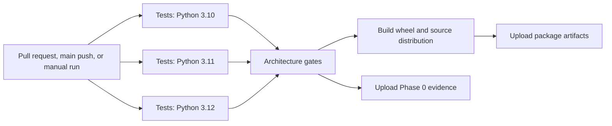

# Continuous-integration workflow

The `ExFusion validation` GitHub Actions workflow is the repository's deterministic merge gate. It runs for pull requests targeting `main`, pushes to `main`, and manual dispatches.

## Execution graph

## Job 1: compatibility test matrix

The complete pytest suite runs independently on Python 3.10, 3.11, and 3.12. Matrix failures do not cancel other versions, which preserves diagnostic evidence across supported runtimes. Dependencies are installed from `pyproject.toml` with the `dev` extra, and pip downloads are cached by Python version. NumPy is an explicit runtime dependency because checkpoint and experiment provenance digest tensors through stable CPU byte representations.

This job guards the legacy `DAPHHybridModelV3` path, canonical Qwen compatibility, training/counterfactual infrastructure, and all regression tests.

## Job 2: architecture gates

This job starts only after every matrix test succeeds. It repeats the scientifically critical tests explicitly:

- exact Gate 0B parity between `QwenCompatModel` and fixed E2;
- physically ordered E0/E1 prefix depth;
- E3 additional compute and latent-delta semantics;
- disabled-branch call counts;
- shallow-exit gradients and E2 distillation;
- exact parameter provenance;
- accumulation remainder and resume accounting.

It then executes the synthetic Phase 0 workflow with shallow continuation modules present. A separate assertion step reads `phase0b_gate_report.json` and rejects the run unless:

- the result is `PASS_EXACT`;
- source-backbone tensors are identical;
- logits pass exact comparison;
- logit mean and maximum absolute errors are zero;
- top-1 agreement is one;
- the canonical Gate 0B checkpoint exists.

Synthetic Phase 0 is an infrastructure gate, not evidence of real pretrained retention. Real HF qualification must use an immutable checkpoint revision and a versioned retention dataset.

The Phase 0 report, metrics, decision, configuration, dataset manifest, and checkpoint are retained as a GitHub artifact for 14 days.

## Job 3: package build

Packaging begins only after architecture qualification. The job builds both the wheel and source distribution, verifies that both exist, lists the wheel contents, and uploads the distributions for 14 days.

## Operational behavior

- Permissions are read-only because CI does not need repository write access.
- Concurrency is scoped to workflow and Git ref; a newer commit cancels an obsolete run for the same branch.
- Jobs have explicit timeouts to prevent stalled runners.
- Generated runs, bytecode, caches, virtual environments, and package outputs remain excluded by `.gitignore`.
- No model secrets or Hugging Face credentials are required for standard CI.

## Recommended branch protection

Configure `main` to require these checks before merging:

- `Tests / Python 3.10`
- `Tests / Python 3.11`
- `Tests / Python 3.12`
- `Exact parity and physical compute gates`
- `Build distributable package`

Also require the branch to be current before merging and prevent force pushes to `main`.

## Manual run

Open the repository's Actions tab, select **ExFusion validation**, and choose **Run workflow**. Manual runs use the selected branch and produce the same evidence and distribution artifacts.
